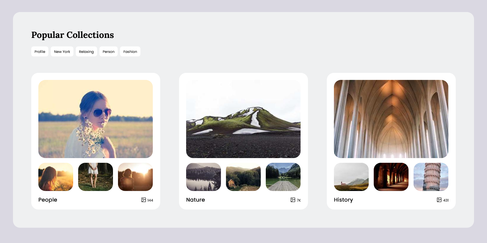
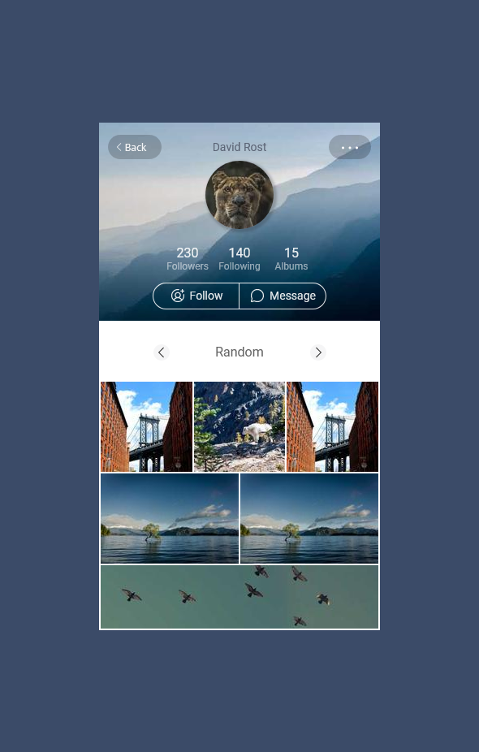

# icodethis

Source code of my completed challenges from [icodethis.com](https://icodethis.com/). 

So far I've been having fun with these. They provide a suitable amount of challenge, but also allow for enough freedom so that I can extend the challenge in whatever way I prefer. 

Is it worth buying a pro membership? I don't know. 

## Redeem Coupon [🔗](https://icodethis.com/modes/design-to-code/517/submissions/289198)
Completed: 25-03-2024

 
Inspired by [this illustration](https://stock.adobe.com/au/images/cassette-tape-vector-illustration/229433573?prev_url=detail). I kind of rushed the end so I didn't add any interactivity. The typo was part of the challenge lol. 

## Collections List [🔗](https://icodethis.com/modes/design-to-code/58/submissions/289403)
Completed: 26-03-2024

 
I decided to follow the given example more closely and make it responsive, but implement some JS interactivity. However, I didn't really complete the scripting - I think there's a lot more I could have done, but I just wanted to move onto another challenge. 

hmmm, I should have spent more time fixing up things in narrower viewports. 

Placeholder images from [Lorem Picsum](https://picsum.photos/).

## Photograph Profile [🔗](https://iCodeThis.com/modes/design-to-code/65/submissions/289628)
Completed: 27-03-2024

 
More JS this time. It was a good challenge in regards to appearance and functionality, especially in regards to the scrolling gallery. It wasn't just difficult to get a smooth horizontal scroll on click, but also to prevent issues with users clicking too quickly. 

Overall, I'm quite proud of this piece (aside from the back button I just noticed).

Placeholder images from [Lorem Picsum](https://picsum.photos/) (again).